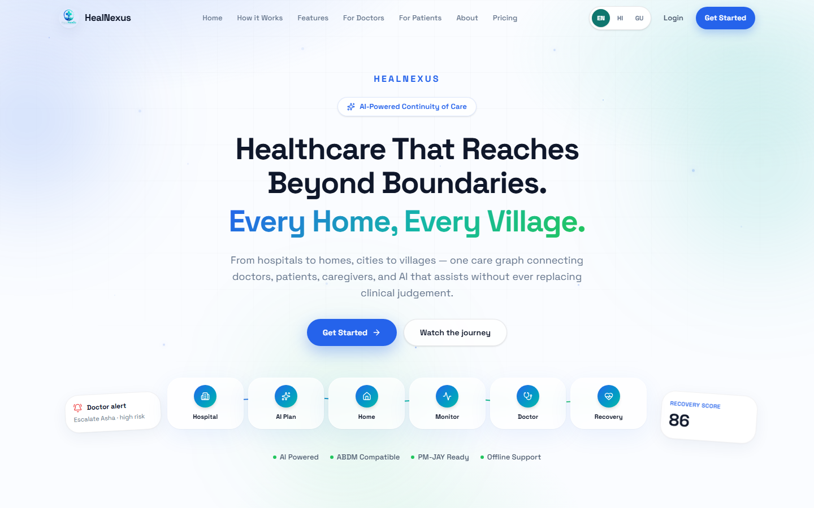
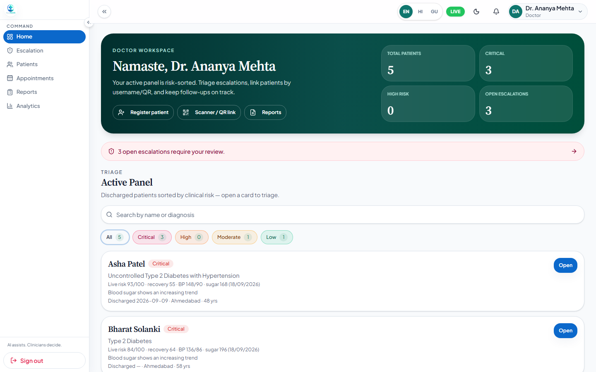
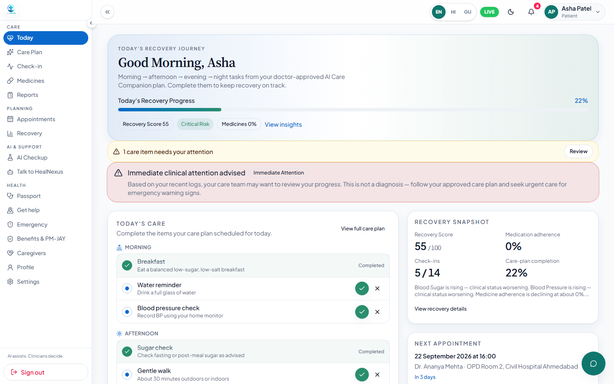
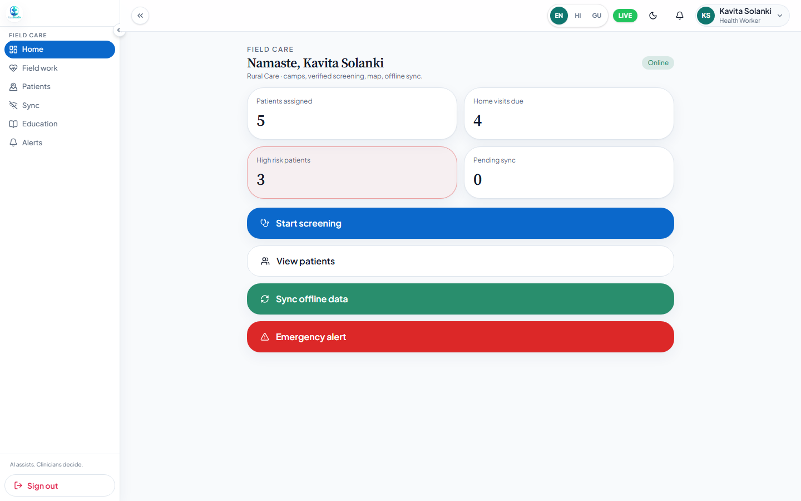
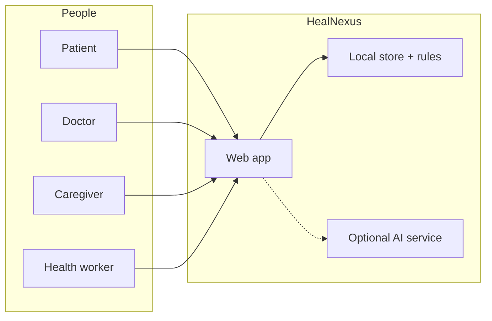
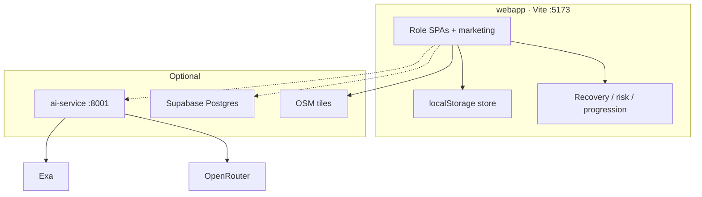

<div align="center">


# HealNexus

### Healthcare that reaches beyond boundaries.<br/>Every home, every village.

From hospitals to homes, cities to villages — one care graph for doctors, patients, caregivers, and rural health workers. **AI assists. Clinicians decide.**

[](https://www.typescriptlang.org/)
[](https://react.dev/)
[](https://vite.dev/)
[](https://fastapi.tiangolo.com/)
[](https://www.python.org/)

[](#features)
[](#clinical-safety)
[](#five-minute-demo)

**[Quick start](#quick-start)** · **[5-minute demo](#five-minute-demo)** · **[Architecture](#system-architecture)** · **[Deploy](#deploy)**

<br/>



<sub>Landing — the same continuity thread from Civil Hospital OPD to a Sanand village home visit.</sub>

<br/>

<table>
<tr>
<td width="50%" align="center">

<br/>
<sub><b>Doctor</b> · live risk, recovery, escalations</sub>
</td>
<td width="50%" align="center">

<br/>
<sub><b>Patient</b> · Today’s care, same scores</sub>
</td>
</tr>
</table>



<sub>Field Care — screening, visits, and offline sync. Language lives in the navbar only (EN / HI / GU).</sub>

</div>

---

## Clinical safety

> HealNexus **never diagnoses, never prescribes, and never changes a doctor’s orders.**  
> AI drafts and education are assistive. **AI assists. Clinicians decide.**

This repo is a **working MVP** — not a slide deck. Role portals, live recovery/risk scores, village caseload, maps, and passport run in the browser with **no API keys**. Optional FastAPI + Exa/OpenRouter unlock grounded chat.

---

## Why HealNexus

Hospitals lose the patient at the gate. After discharge, medicines are missed, vitals drift, labs go overdue, and rural families cannot always reach the same OPD. Doctors see **static labels**. ASHA / ANM workers work from paper.

| Gap | What this MVP closes (Ahmedabad / Gujarat demo) |
| :---: | --- |
| Follow-up | Diabetes, hypertension, COPD, surgery recovery on one thread |
| Language | English, Hindi, Gujarati — same safety rails |
| Rural path | Village PHC → CHC → district hospital |
| Offline | Health Card / passport when the network drops |
| Trust | Assistive AI that **does not** impersonate a doctor |

**One continuity graph:** patient · family · doctor · health worker. When a check-in, missed dose, or overdue lab changes, **the doctor list and the patient Recovery page show the same numbers.**



| Layer | What you are judging |
| --- | --- |
| **`webapp/`** | React 19 + Vite + TypeScript — five roles, marketing, `/pricing` |
| **Local store** | Browser `localStorage` seed (Ahmedabad + villages) |
| **Rule engines** | Recovery, readmission risk, progression, alerts from live check-ins |
| **`ai-service/`** | Optional FastAPI — companion, visit brief, assistant, medicine extract |
| **`supabase/`** | Optional Postgres + RLS — **not required** to demo |

---

## Features

Sign in on `/login` with **live role buttons**, or User ID + `demo123`.

| Try this | Where |
| --- | --- |
| Live risk + recovery caseload | Doctor → Home / Active Panel |
| Today dashboard + Recovery | Patient → Today / Recovery |
| Check-in, medicines, care plan | Patient modules |
| Talk to HealNexus | Patient companion · optional Exa + OpenRouter |
| AI Doctor Visit Brief | Doctor patient record · optional LLM |
| Medicine camera scanner | Patient → Scan · optional extract |
| Nearest care (PHC, shop, lab) | Patient → Get help · Leaflet / OSM |
| Offline Health Card / Passport QR | Patient → Passport |
| Family alerts | Priya · Caregiver |
| Village home visits & screening | Kavita · Health Worker |
| EN / HI / GU | Navbar language switcher |
| Pricing (B2C + B2B + sponsored) | `/pricing` |

**No keys:** portals, scores, OSM maps, passport, check-ins, villages.  
**With AI service:** grounded assistant and LLM drafts. Without keys those calls fail closed — the rest still runs.

---

## Pricing model

Presentation only (`webapp/src/modules/marketing/pricing-config.ts`) — **not billed**.

| Who | Price | Intent |
| --- | --- | --- |
| Individual | **₹0** / **₹99**/mo | Free everyday care · Care = personal AI |
| Family | **₹199**/mo | Up to 5 members |
| Hospitals | **₹4,999+** / Custom | Proposed SaaS — labelled as proposed |
| Communities | Sponsored | NGOs / CSR / public health *potential* — no fake gov partnerships |

---

## Technology stack

**This team built:** role modules (patient, doctor, caregiver, health worker, admin, identity) · Ahmedabad / village seed · in-app health intelligence (`health-engine`, `clinical-risk.ts`) · FastAPI Care Companion orchestration + safety copy · custom EN / HI / GU dictionaries · marketing + pricing UX.

| Piece | Terms | Use |
| --- | --- | --- |
| React 19, Vite, TypeScript, Tailwind 4 | MIT | App shell |
| React Router, TanStack Query, Zod, RHF | MIT | Routing, cache, forms |
| Framer Motion, GSAP, Lucide, Recharts | MIT / ISC | Motion, icons, charts |
| Three.js / R3F / Drei | MIT | Marketing 3D |
| Leaflet + OpenStreetMap | BSD / ODbL | Care-site map tiles |
| FastAPI, Uvicorn, Pydantic, httpx | MIT / BSD | AI service |
| `@supabase/supabase-js` | Apache-2.0 | Optional client |
| **Exa** | Vendor ToS | Server-side medical **search** |
| **OpenRouter** | Vendor + model ToS | Server-side LLM **synthesis** |

Demo patients and village coordinates are **synthetic / curated**. Scores are **explainable rules**, not a production model we trained. We do **not** claim OSM, Exa, or OpenRouter as team-built models.

---

## System architecture



Keys for Exa / OpenRouter live **only** in `ai-service/.env` (or Render). Never in Vite.  
Longer notes: [`docs/HealNexus_SRS_Architecture.md`](docs/HealNexus_SRS_Architecture.md) · [`docs/FINALIZED_ARCHITECTURE.md`](docs/FINALIZED_ARCHITECTURE.md)

```text
HealNexus/
├── webapp/                 # MVP UI, store, engines, /pricing
├── ai-service/             # Optional FastAPI
├── supabase/migrations/    # Optional SQL
├── assets/                 # Product screenshots
├── docs/                   # SRS
└── README.md
```

---

## APIs

Interactive docs: [http://127.0.0.1:8001/docs](http://127.0.0.1:8001/docs) when the AI service is up.

<details>
<summary><strong>Endpoint list</strong></summary>

| Method | Path | Purpose |
| --- | --- | --- |
| GET | `/health` | Health + whether Exa/OpenRouter are configured |
| POST | `/ai/care-companion` | Discharge → schedule JSON (draft) |
| POST | `/ai/patient-summary` | Short assistive summary |
| POST | `/ai/visit-brief` | Doctor visit brief |
| POST | `/ai/medicine/extract` | Label/text extract — not a prescription |
| POST | `/ai/health-assistant` | Education (Exa + LLM) |
| POST | `/ai/emergency-checkup` | Education, not diagnosis |
| POST | `/ai/education` | Localized pack |
| POST | `/ai/government-guidance` | PM-JAY-style **demo** + search |
| POST | `/predict/*` | Optional server twins of recovery, risk, trends, alerts, explain |

</details>

Demo **CRUD is the local store**, not a public REST API. `VITE_AI_API_BASE_URL` is only the AI origin.

---

## Database

**Default (zero install):** `localStorage` key `healnexus-dynamic-store-v2` · seed in `webapp/src/data/store/seed.ts`.  
`demo123` is a **public demo password**, not a production secret. Hard-refresh after a pull if the seed version bumped.

**Optional:** `supabase/migrations/` → project URL + **anon** key on the webapp. Service role never in GitHub / never in Vite.

---

## Quick start

**Need:** Node.js **20+**, npm. Optional: Python **3.11+**.

```bash
cd webapp
cp .env.example .env          # Windows: copy .env.example .env
npm install
npm run dev
```

Open **http://127.0.0.1:5173**

```bash
npm run build && npm run preview
```

### Optional AI service

```bash
cd ai-service
python -m venv .venv
# Windows: .venv\Scripts\activate
pip install -r requirements.txt
cp .env.example .env          # EXA_API_KEY + OPENROUTER_API_KEY here only
python -m uvicorn app.main:app --host 127.0.0.1 --port 8001
```

`webapp/.env`: `VITE_AI_API_BASE_URL=http://127.0.0.1:8001` → restart Vite.

| File | Git |
| --- | --- |
| `*.env.example` | Yes |
| `webapp/.env`, `ai-service/.env` | **No** |

---

## Five-minute demo

1. `cd webapp && npm install && npm run dev`
2. **Dr. Ananya · Doctor** → Home: live Recovery + risk, village rows
3. Sign out → **Asha · Patient** → Today / Recovery: **same scores**
4. Get help → nearest PHC / pharmacy
5. Optional: AI service → Talk to HealNexus

| Role | User ID | Password |
| --- | --- | --- |
| Patient | `asha.patel` · `ravi.shah` · `meera.desai` · `bharat.solanki` · `leela.chauhan` | `demo123` |
| Doctor / Caregiver / HW / Admin | Live buttons, or `priya.patel` · `kavita.solanki` · `admin` | `demo123` |

---

## Deploy

**Judges can use Vercel alone** (`localStorage`, no keys).

1. GitHub → Vercel → **Root Directory: `webapp`**
2. Vite · `npm run build` · output `dist` · Node 20
3. `webapp/vercel.json` already rewrites the SPA
4. `VITE_*` vars = **Config**, not Secret. Do **not** put OpenRouter on Vercel

**LLM / Exa:** Render Web Service, root `ai-service`, start:

```bash
uvicorn app.main:app --host 0.0.0.0 --port $PORT
```

Render env: `OPENROUTER_API_KEY`, `EXA_API_KEY`, `CORS_ORIGINS=https://your-app.vercel.app`  
Then Vercel **build** env: `VITE_AI_API_BASE_URL=https://your-service.onrender.com` → **Redeploy**.

---

## Secrets & credentials

- `.gitignore` covers `.env`, `*.pem`, `*.key`
- No `VITE_EXA_API_KEY` in the client
- Rotate any key that was pasted into chat

---

## AI tools disclosure

**Put this on the PPT.** This product used **significant AI coding assistance** (including Cursor) for scaffolding, refactoring, and docs. **The team can explain every submitted flow.** That help is **not** unaided original work.

In-product AI (companion, visit brief, assistant) is a **feature**, with the same clinical safety copy.

---

## Originality

HealNexus is an original continuity-of-care product in this repository. Third-party libraries, OSM, Exa, and OpenRouter are named above. Clinical demo numbers come from **our rules + synthetic seed**, not a copied trained model.

---

<div align="center">

**Healthcare that reaches beyond boundaries** — every home, every village.

*AI assists. Clinicians decide.*

</div>
